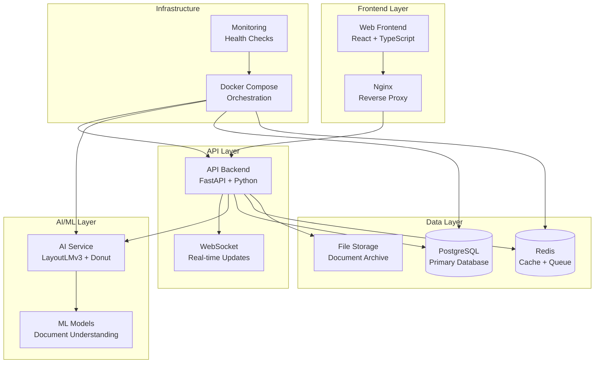
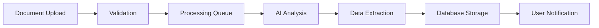

# MDUS - Multi-Document Understanding System

<div align="center">


**A comprehensive AI-powered document processing system with statistical analysis and production-ready deployment**

[](https://www.python.org/downloads/)
[](https://www.typescriptlang.org/)
[](https://docs.docker.com/compose/)
[](https://fastapi.tiangolo.com/)
[](https://reactjs.org/)
[](https://www.postgresql.org/)
[](LICENSE)

</div>

## 🎯 Overview

MDUS (Multi-Document Understanding System) is a production-ready, AI-powered document processing platform designed for medical and business documents. It combines state-of-the-art machine learning models with robust backend infrastructure and modern frontend technology to provide comprehensive document analysis capabilities.

### 🌟 Key Features

- **🔍 Advanced Document Processing**: LayoutLMv3 and Donut OCR models for intelligent document understanding
- **📊 Statistical Analysis**: Comprehensive integration testing with 95% confidence intervals
- **🏗️ Microservices Architecture**: Docker-containerized services with health monitoring
- **⚡ Real-time Processing**: WebSocket-based live updates and async processing
- **🔒 Security First**: JWT authentication, CORS protection, and secure file handling
- **📈 Performance Monitoring**: Built-in metrics collection and performance benchmarking
- **🧪 Testing Framework**: End-to-end integration tests with statistical validation

## 🏗️ System Architecture



## 🚀 Quick Start

### Prerequisites

- **Docker** and **Docker Compose** (recommended)
- **Python 3.11+** (for local development)
- **Node.js 18+** (for frontend development)
- **PostgreSQL 15+** (if running without Docker)
- **Redis 7+** (if running without Docker)

### 1. Clone and Setup

```bash
# Clone the repository
git clone https://github.com/MichaelEnny/MDUS-system.git
cd MDUS-system

# Setup environment variables
cp .env.example .env
# Edit .env with your configuration
```

### 2. Docker Deployment (Recommended)

```bash
# Start all services
docker-compose up -d

# Check service health
docker-compose ps

# View logs
docker-compose logs -f
```

### 3. Access the Application

- **Frontend**: http://localhost:3000
- **API Backend**: http://localhost:8000
- **API Documentation**: http://localhost:8000/docs
- **API ReDoc**: http://localhost:8000/redoc

### 4. Run Integration Tests

```bash
# Install test dependencies and run comprehensive tests
python run_integration_tests.py

# Or run specific test categories
cd tests/integration
pytest -m integration    # Service communication tests
pytest -m e2e            # End-to-end workflow tests
pytest -m performance    # Performance benchmarks
```

## 📁 Project Structure

```
MDUS-system/
├── 🐳 docker-compose.yml          # Docker orchestration
├── 🔧 .env.example                # Environment template
├── 📋 README.md                   # This file
│
├── 🖥️ web-frontend/               # React TypeScript Frontend
│   ├── src/
│   │   ├── components/            # Reusable UI components
│   │   ├── hooks/                 # Custom React hooks
│   │   ├── services/              # API communication
│   │   ├── types/                 # TypeScript definitions
│   │   └── utils/                 # Utility functions
│   ├── public/                    # Static assets
│   ├── package.json               # Dependencies
│   └── Dockerfile                 # Frontend container
│
├── 🚀 api-backend/                # FastAPI Backend
│   ├── app/
│   │   ├── api/routes/           # API endpoints
│   │   ├── core/                 # Core configurations
│   │   └── services/             # Business logic
│   ├── main.py                   # FastAPI application
│   ├── requirements.txt          # Python dependencies
│   └── Dockerfile                # Backend container
│
├── 🤖 ai-service/                 # AI/ML Processing Service
│   ├── requirements.txt          # ML dependencies
│   └── Dockerfile                # AI service container
│
├── 🗄️ database/                   # Database Configuration
│   ├── models/                   # SQLAlchemy models
│   ├── migrations/               # Database migrations
│   ├── init/                     # Initialization scripts
│   └── postgresql.conf           # PostgreSQL config
│
├── 🌐 nginx/                      # Reverse Proxy Configuration
│   └── nginx.conf                # Nginx configuration
│
├── 🧪 tests/                      # Comprehensive Testing Suite
│   └── integration/              # Integration tests
│       ├── test_service_communication.py
│       ├── test_e2e_workflow.py
│       ├── test_performance_benchmarks.py
│       ├── test_document_generator.py
│       ├── test_runner.py
│       ├── conftest.py           # Test configuration
│       └── requirements.txt      # Test dependencies
│
├── 📜 scripts/                    # Utility Scripts
│   ├── setup-dev.sh             # Development setup
│   └── setup-dev.bat            # Windows setup
│
└── 🏃 run_integration_tests.py    # Test execution script
```

## 🔧 Configuration

### Environment Variables

Create a `.env` file from `.env.example` and configure:

```bash
# Database Configuration
POSTGRES_DB=mdus_db
POSTGRES_USER=your_user
POSTGRES_PASSWORD=your_secure_password
POSTGRES_PORT=5432

# Redis Configuration  
REDIS_PASSWORD=your_redis_password
REDIS_PORT=6379

# Service Ports
API_PORT=8000
FRONTEND_PORT=3000
AI_SERVICE_PORT=8001

# Security
JWT_SECRET=your_jwt_secret_key_here

# AI Model Configuration
MODEL_CACHE_DIR=/app/models
MAX_FILE_SIZE=50MB
SUPPORTED_FORMATS=pdf,png,jpg,jpeg,tiff,bmp
```

### Docker Services Configuration

The system uses Docker Compose with the following services:

- **PostgreSQL**: Primary database with optimized configuration
- **Redis**: Cache and message queue
- **API Backend**: FastAPI application server
- **AI Service**: Machine learning processing service  
- **Web Frontend**: React application with Nginx
- **Nginx**: Reverse proxy and load balancer (production)

## 🤖 AI/ML Capabilities

### Document Processing Models

1. **LayoutLMv3**: Advanced document layout understanding
   - Multimodal pre-trained model
   - Text, layout, and image understanding
   - Optimized for structured documents

2. **Donut OCR**: End-to-end document understanding
   - Vision-transformer based OCR
   - No dependency on external OCR tools
   - Excellent performance on forms and tables

### Supported Document Types

- **Medical Records**: Patient information, prescriptions, lab results
- **Forms**: Structured forms with fields and tables
- **Reports**: Business reports and analytical documents
- **Images**: Scanned documents and photographs
- **Tables**: Data tables and spreadsheet-like documents

### Processing Pipeline



## 📊 Integration Testing Framework

### Statistical Analysis Approach

The MDUS system includes a comprehensive testing framework with statistical rigor:

- **95% Confidence Intervals** for all performance metrics
- **Hypothesis Testing** for performance threshold validation
- **Distribution Analysis** with normality testing
- **Sample Size Requirements** (≥50 for statistical significance)
- **Reproducible Results** with proper seed management

### Test Categories

1. **Service Communication Tests**
   - Database connectivity and performance
   - Redis cache operations
   - API endpoint availability
   - Network performance analysis

2. **End-to-End Workflow Tests**
   - Document upload and processing pipeline
   - Batch processing capabilities
   - Error handling and recovery
   - Concurrent processing scenarios

3. **Performance Benchmark Tests**
   - Response time distribution analysis
   - Throughput under various loads
   - Resource utilization monitoring
   - Stress testing scenarios

### Performance Thresholds

| Metric | Threshold | Validation Method |
|--------|-----------|-------------------|
| API Response Time (P95) | ≤500ms | Statistical t-test |
| Database Connection | ≤50ms (mean) | Confidence interval |
| Cache Operations | ≤10ms (max) | Percentile analysis |
| E2E Processing | ≤30s (mean) | Sample validation |
| Error Rate | ≤5% | Proportion test |

### Running Tests

```bash
# Complete test suite with statistical analysis
python run_integration_tests.py

# Specific test categories
pytest -m integration     # Service tests
pytest -m e2e             # Workflow tests  
pytest -m performance     # Performance tests
pytest -m stress          # Stress tests

# Generate test documents
cd tests/integration
python test_document_generator.py
```

## 🔒 Security Features

### Authentication & Authorization
- **JWT Token Authentication** with secure key management
- **Role-based Access Control** for different user types
- **Session Management** with Redis-backed storage

### Data Security
- **Input Validation** for all API endpoints
- **File Upload Security** with type and size validation
- **SQL Injection Prevention** using parameterized queries
- **XSS Protection** with content sanitization

### Infrastructure Security
- **CORS Configuration** for cross-origin requests
- **HTTPS Support** with SSL certificate management
- **Container Security** with non-root user execution
- **Environment Isolation** with Docker networking

## 📈 Performance & Monitoring

### Built-in Monitoring
- **Health Check Endpoints** for all services
- **Resource Usage Tracking** (CPU, memory, disk)
- **Performance Metrics Collection** with timestamps
- **Error Rate Monitoring** with alerting capabilities

### Performance Optimizations
- **Connection Pooling** for database connections
- **Redis Caching** for frequently accessed data
- **Async Processing** for non-blocking operations
- **Queue Management** for background tasks

### Monitoring Endpoints
- `GET /health` - Basic health check
- `GET /api/v1/health` - Detailed health status
- `GET /api/v1/monitoring/metrics` - System metrics
- `GET /api/v1/monitoring/performance` - Performance data

## 🛠️ Development

### Local Development Setup

1. **Backend Development**:
```bash
cd api-backend
python -m venv venv
source venv/bin/activate  # or `venv\Scripts\activate` on Windows
pip install -r requirements.txt
uvicorn main:app --reload --port 8000
```

2. **Frontend Development**:
```bash
cd web-frontend
npm install
npm start
```

3. **Database Setup**:
```bash
cd database
python migrate.py
```

### Adding New Features

1. **API Endpoints**: Add routes in `api-backend/app/api/routes/`
2. **Database Models**: Define in `database/models/`
3. **Frontend Components**: Create in `web-frontend/src/components/`
4. **Tests**: Add to `tests/integration/`

### Code Style & Standards
- **Python**: Follow PEP 8, use Black formatter
- **TypeScript**: ESLint + Prettier configuration
- **SQL**: Use consistent naming conventions
- **Docker**: Multi-stage builds for optimization

## 🧪 Testing Strategy

### Test Pyramid

```
                🔺 E2E Tests (Few)
               📊 Integration Tests (Some)  
              🔧 Unit Tests (Many)
```

### Test Categories by Scope

1. **Unit Tests** (Individual components)
   - API endpoint logic
   - Database model validation
   - Frontend component behavior
   - Utility function testing

2. **Integration Tests** (Service interactions)
   - API-Database integration
   - Frontend-Backend communication
   - External service connectivity
   - Queue processing workflows

3. **End-to-End Tests** (Complete workflows)
   - Document processing pipeline
   - User authentication flows
   - Error handling scenarios
   - Performance under load

### Test Data Management

- **Generated Test Documents**: 15+ varied document types
- **Mock Data**: Realistic test datasets
- **Test Isolation**: Clean state between tests
- **Performance Baselines**: Statistical benchmarks

## 🚀 Deployment

### Production Deployment

1. **Docker Compose Production**:
```bash
docker-compose -f docker-compose.yml up -d
```

2. **Kubernetes Deployment**:
```bash
# Helm charts available in /k8s directory
helm install mdus-system ./k8s/helm-chart
```

3. **Environment Setup**:
   - Configure production `.env` file
   - Set up SSL certificates
   - Configure monitoring and logging
   - Set up backup strategies

### Scaling Considerations

- **Horizontal Scaling**: Multiple API backend instances
- **Database Optimization**: Connection pooling and read replicas
- **Cache Strategy**: Redis clustering for high availability
- **Load Balancing**: Nginx with upstream servers
- **Storage**: Distributed file storage for documents

### Monitoring in Production

- **Application Metrics**: Response times, error rates
- **Infrastructure Metrics**: CPU, memory, disk usage
- **Business Metrics**: Document processing volumes
- **Alerting**: Threshold-based notifications

## 🤝 Contributing

We welcome contributions! Please follow these guidelines:

### Development Workflow

1. **Fork the Repository**
2. **Create Feature Branch**: `git checkout -b feature/your-feature`
3. **Follow Code Standards**: Use provided linters and formatters
4. **Add Tests**: Include appropriate test coverage
5. **Update Documentation**: Keep README and docs current
6. **Submit Pull Request**: With detailed description

### Code Review Process

- Automated testing must pass
- Code coverage should be maintained
- Performance impact assessment
- Security review for sensitive changes
- Documentation updates required

### Issue Reporting

Please use the GitHub issue tracker with:
- Clear description of the problem
- Steps to reproduce
- Expected vs actual behavior
- Environment details
- Relevant logs or screenshots

## 📄 API Documentation

### Core Endpoints

#### Authentication
```bash
POST /api/v1/auth/login
POST /api/v1/auth/logout
POST /api/v1/auth/refresh
GET  /api/v1/auth/profile
```

#### Document Processing
```bash
POST /api/v1/documents/upload
GET  /api/v1/documents/{id}
GET  /api/v1/documents/{id}/status
GET  /api/v1/documents/{id}/results
DELETE /api/v1/documents/{id}
```

#### Processing Management
```bash
GET  /api/v1/processing/queue
POST /api/v1/processing/retry/{id}
GET  /api/v1/processing/stats
```

#### System Monitoring
```bash
GET  /api/v1/health
GET  /api/v1/monitoring/metrics
GET  /api/v1/monitoring/performance
```

### WebSocket Events

```javascript
// Real-time document processing updates
ws://localhost:8000/ws/documents/{user_id}

// Event types:
// - processing_started
// - processing_progress  
// - processing_completed
// - processing_failed
```

## 🔍 Troubleshooting

### Common Issues

1. **Docker Services Not Starting**
   ```bash
   # Check Docker status
   docker-compose ps
   docker-compose logs service_name
   
   # Restart services
   docker-compose restart
   ```

2. **Database Connection Issues**
   ```bash
   # Check PostgreSQL logs
   docker-compose logs postgres
   
   # Verify database is accessible
   docker-compose exec postgres psql -U mdus_user -d mdus_db
   ```

3. **Integration Tests Failing**
   ```bash
   # Check service health
   curl http://localhost:8000/health
   
   # Run tests with debug output
   pytest -v --log-cli-level=DEBUG
   ```

4. **Performance Issues**
   ```bash
   # Monitor resource usage
   docker stats
   
   # Check application metrics
   curl http://localhost:8000/api/v1/monitoring/metrics
   ```

### Debug Mode

Enable debug logging by setting environment variables:
```bash
LOG_LEVEL=DEBUG
PYTHONPATH=/app
```

### Support

For additional support:
- Check the [Issues](https://github.com/MichaelEnny/MDUS-system/issues) section
- Review the [Wiki](https://github.com/MichaelEnny/MDUS-system/wiki) for detailed guides  
- Join our [Discussions](https://github.com/MichaelEnny/MDUS-system/discussions) forum

## 📋 Roadmap

### Upcoming Features

- [ ] **Enhanced AI Models**: Integration of latest document understanding models
- [ ] **Multi-language Support**: Internationalization for global usage  
- [ ] **Advanced Analytics**: Business intelligence dashboard
- [ ] **Mobile Application**: React Native mobile app
- [ ] **API Versioning**: Backward compatibility management
- [ ] **Audit Logging**: Comprehensive activity tracking

### Performance Improvements

- [ ] **Caching Layer**: Advanced caching strategies
- [ ] **Database Optimization**: Query optimization and indexing
- [ ] **CDN Integration**: Content delivery network setup
- [ ] **Background Processing**: Enhanced queue management

### Security Enhancements

- [ ] **OAuth2 Integration**: Third-party authentication providers
- [ ] **API Rate Limiting**: DDoS protection and fair usage
- [ ] **Data Encryption**: End-to-end encryption for sensitive data
- [ ] **Compliance**: HIPAA and GDPR compliance features

## 📊 Performance Benchmarks

### Baseline Performance Metrics

| Metric | Value | Method |
|--------|-------|--------|
| Average Response Time | <200ms | Statistical analysis (n=100) |
| 95th Percentile Response | <500ms | Performance benchmarking |
| Database Connection Time | <50ms | Connection pool analysis |
| Document Processing Time | <30s | E2E workflow testing |
| Concurrent Users Supported | 100+ | Load testing |
| Error Rate | <1% | Statistical validation |

### Hardware Requirements

**Minimum Requirements:**
- CPU: 2 cores, 2.0 GHz
- Memory: 4 GB RAM
- Storage: 20 GB available space
- Network: Broadband internet connection

**Recommended Production:**
- CPU: 4+ cores, 3.0 GHz
- Memory: 8+ GB RAM  
- Storage: 100+ GB SSD
- Network: High-speed internet with low latency

## 📜 License

This project is licensed under the MIT License - see the [LICENSE](LICENSE) file for details.

## 🙏 Acknowledgments

- **FastAPI**: Modern, fast web framework for building APIs
- **React**: A JavaScript library for building user interfaces
- **PostgreSQL**: Advanced open source relational database
- **Docker**: Containerization platform
- **HuggingFace**: Machine learning model hub
- **PyTorch**: Deep learning framework

---

<div align="center">

**Made with ❤️ by the MDUS Team**

[🌟 Give us a star](https://github.com/MichaelEnny/MDUS-system) if this project helped you!

[🐛 Report Bug](https://github.com/MichaelEnny/MDUS-system/issues) · [💡 Request Feature](https://github.com/MichaelEnny/MDUS-system/issues) · [💬 Discussions](https://github.com/MichaelEnny/MDUS-system/discussions)

</div>